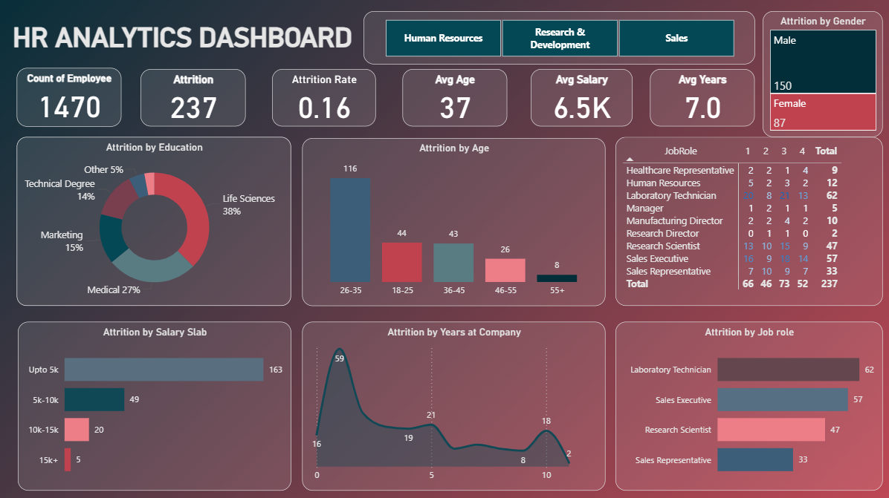

# HR Analytics Dashboard (Power BI)

## Dashboard Preview

---

## Overview
This project presents an interactive **HR Analytics Dashboard** built using Power BI to analyze employee data and understand workforce trends.

The dashboard helps HR teams monitor employee retention, identify attrition patterns, and support data-driven decision-making.

---

## Business Problem
Employee attrition is a major challenge for organizations, leading to increased hiring costs and reduced productivity.

This project focuses on:
- Analyzing employee retention patterns  
- Identifying high-risk departments and roles  
- Understanding factors influencing attrition  
- Supporting HR decision-making with data insights  

---

## Key Metrics
- Total Employees: 1470  
- Attrition Count: 237  
- Attrition Rate: 16%  
- Average Age: 37  
- Average Salary: 6.5K  
- Average Years at Company: 7.0  

---

## Dashboard Insights

### Attrition Analysis
- Highest attrition observed in **26–35 age group**  
- High turnover in **Laboratory Technician and Sales Executive roles**  
- Employees in **lower salary slabs (≤5K)** show higher attrition  

### Workforce Insights
- Majority employees belong to **Life Sciences and Medical backgrounds**  
- Gender-based differences observed in attrition trends  

### Tenure Analysis
- Most employees leave within the **first few years**  
- Attrition decreases as experience increases  

---

## Visualizations Included
- Attrition by Education  
- Attrition by Age  
- Attrition by Salary Slab  
- Attrition by Years at Company  
- Attrition by Job Role  
- Attrition by Gender  

---

## Business Impact
- Helps HR identify **high-risk employee segments**  
- Supports **retention strategy planning**  
- Enables **data-driven workforce decisions**  
- Reduces employee turnover costs  

---

## Tools & Technologies
- Power BI  
- DAX  
- Power Query  
- Data Visualization  

---

## Dataset
- [Dataset](https://drive.google.com/file/d/1qdOnNyBVGDtLPWp_zo029OmeL4cJiaDv/view?usp=share_link)

---

## Author
Ramu Battu  
MS Data Analytics, California State University, Fresno
